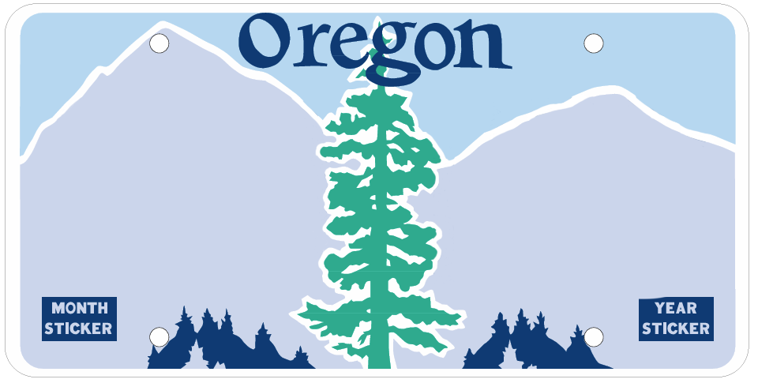

# LicensePlateSim

This small Flask app generates a simulated Oregon license plate by overlaying user-provided text onto a base plate image and allows exporting the result as a PNG.



## Features
- Generate a simulated Oregon license plate with custom text.
- Letter-spacing support and centering for up to 7 characters.
- Export generated plate as PNG (download or base64 in API response).
- Uses Pillow for image composition and Flask for a simple web UI.

## Project structure
- `app.py` - Main Flask application and plate generation logic.
- `static/images/oregon_standard_clean.png` - Base (clean) Oregon plate image used as the template.
- `static/output/` - Output directory for generated images (created at runtime).
- `templates/index.html` - Frontend HTML for interacting with the generator.
- `.venv/` - (Optional) Local virtual environment (recommended)

## Prerequisites
- Python 3.8+
- Recommended: create and activate a virtual environment in the project root.

## Setup (Windows PowerShell)
```powershell
Set-Location 'C:\Users\jmh55\Dev\Python\LicensePlateSim'
python -m venv .venv
.\.venv\Scripts\Activate.ps1
pip install --upgrade pip
pip install -r requirements.txt
```

If you prefer, use your system Python or create the venv with a different name.

## Running the app
```powershell
# Activate venv if you haven't already
.\.venv\Scripts\Activate.ps1
python app.py
```
Open http://localhost:5000 in your browser.

## API
- POST `/generate` (JSON)
  - body: `{ "text": "ABC123", "plate_type": "standard" }`
  - response: `{ "success": true, "image": "data:image/png;base64,...", "filename": "oregon_plate_ABC123_YYYYMMDD_HHMMSS.png" }

- GET `/download/<text>` - Returns generated PNG as an attachment.

## Notes & Tips
- The app tries multiple font file locations for cross-platform compatibility. For consistent output, you may bundle a TTF/OTF font in the project and update the font path in `app.py`.
- If `requirements.txt` is missing or incomplete, run `pip install Flask Pillow`.
- Max characters default is 7; the app truncates longer inputs.

## License
This repo has no license file by default. Add `LICENSE` if you want to specify one.

---
Generated by examining `app.py` in the workspace.
